# Rishfy System Architecture

> **Comprehensive architectural reference for the Rishfy platform**
> Target Architecture: Service-Oriented Architecture (Phase 2)
> Target Scale: 1,000–50,000 concurrent users

---

## Table of Contents

1. [Architectural Principles](#1-architectural-principles)
2. [System Context](#2-system-context)
3. [High-Level Architecture](#3-high-level-architecture)
4. [Service Decomposition](#4-service-decomposition)
5. [Data Architecture](#5-data-architecture)
6. [Communication Patterns](#6-communication-patterns)
7. [Cross-Cutting Concerns](#7-cross-cutting-concerns)
8. [Deployment Architecture](#8-deployment-architecture)
9. [Architecture Decision Records (ADRs)](#9-architecture-decision-records-adrs)
10. [Scalability Strategy](#10-scalability-strategy)

---

## 1. Architectural Principles

These principles guide every design decision on the Rishfy platform:

### 1.1 Core Principles

| Principle | Description | Trade-off |
|-----------|-------------|-----------|
| **Service Autonomy** | Each service owns its data and business logic | Data duplication vs. coupling |
| **Failure Isolation** | One service failure must not cascade | Complexity vs. resilience |
| **API-First** | All communication via versioned APIs | Upfront design cost vs. integration speed |
| **Observability** | Every request traceable, every metric visible | Storage cost vs. debuggability |
| **Security by Default** | Least privilege, encrypted transit, audited access | Dev friction vs. security posture |
| **Compliance-Ready** | LATRA requirements built-in, not bolted-on | Design constraint vs. regulatory risk |

### 1.2 Non-Negotiables

- ❌ **No shared databases** between services
- ❌ **No synchronous chains** deeper than 2 hops
- ❌ **No secrets in code** or version control
- ❌ **No direct database access** from mobile apps
- ❌ **No features without tests**

### 1.3 Pragmatic Compromises

Given our academic timeline (12 weeks, 4 developers), we explicitly accept:

- ✅ Monorepo instead of polyrepo (simpler coordination)
- ✅ Shared PostgreSQL cluster with logical databases (vs. separate instances)
- ✅ Single Redis instance (vs. cluster) until scaling demands it
- ✅ Kafka only where async is essential (not as default)
- ✅ Manual deployment initially, CI/CD by Sprint 4

---

## 2. System Context

### 2.1 Context Diagram

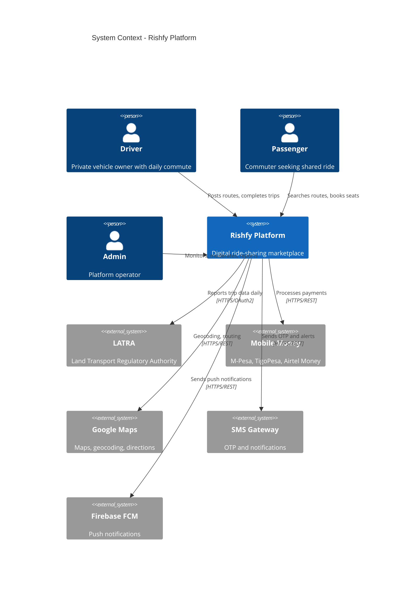

### 2.2 Key Stakeholders

| Stakeholder | Concerns | Architectural Response |
|-------------|----------|------------------------|
| **Drivers** | Easy route posting, reliable payments, safety | Simple mobile UX, instant payment confirmation, driver rating system |
| **Passengers** | Quick search, trust, predictable fares | Sub-2-second search, verification badges, upfront pricing |
| **LATRA** | Regulatory compliance, auditable trip data | Automated daily reporting API, tamper-evident logs |
| **Platform Operators** | System health, fraud detection, revenue | Monitoring dashboards, admin panel, commission tracking |
| **Developers** | Maintainable code, clear boundaries | SOA with clear service contracts, extensive documentation |

---

## 3. High-Level Architecture

### 3.1 Layered View

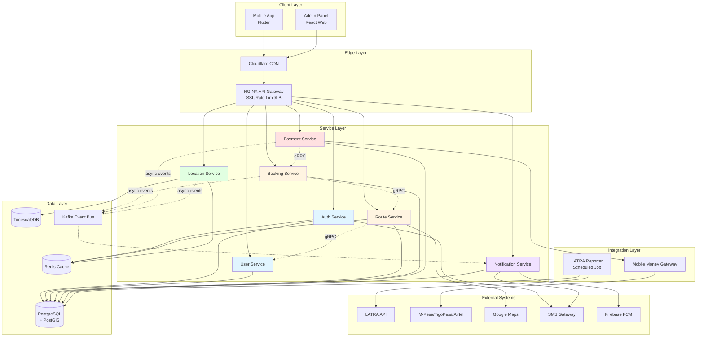

### 3.2 Request Flow Example: Passenger Books a Ride

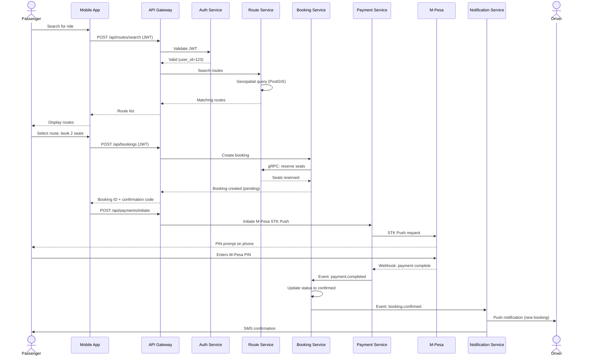

---

## 4. Service Decomposition

### 4.1 Service Catalog

| # | Service | Port | Owner | Responsibility | Database |
|---|---------|------|-------|----------------|----------|
| 1 | **Auth** | 3001 | Stella | Authentication, JWT, OTP, sessions | `auth_db` |
| 2 | **User** | 3002 | Stella | Profiles, driver details, vehicles | `user_db` |
| 3 | **Route** | 3003 | Godbless | Route CRUD, search, matching | `route_db` |
| 4 | **Booking** | 3004 | Ezekiel | Reservations, trips, ratings | `booking_db` |
| 5 | **Payment** | 3005 | Ezekiel | M-Pesa/TigoPesa/Airtel, refunds | `payment_db` |
| 6 | **Location** | 3006 | Godbless | GPS tracking, geospatial indexing | `location_db` (TimescaleDB) |
| 7 | **Notification** | 3007 | Fatma | Push, SMS, email, queue | `notification_db` |

### 4.2 Service Boundaries (What Belongs Where)

Decision rules for "which service owns this?":

| Data/Logic | Service | Rationale |
|------------|---------|-----------|
| Password hash | Auth | Only auth needs it |
| User's name, photo | User | Displayed publicly, independent of auth |
| Driver's license number | User | Part of driver profile |
| Vehicle registration | User | Driver-owned asset |
| Route's origin/destination | Route | Core route data |
| Available seats count | Route | Changes with bookings (single source of truth) |
| Booking's passenger ID | Booking | References user, but booking owns relationship |
| Trip's actual distance | Booking | Calculated at trip end, owned by booking |
| GPS coordinates over time | Location | Time-series, different access pattern |
| Payment transaction ref | Payment | External system integration |
| Push notification token | Notification | Delivery mechanism ownership |
| Rating value | Booking | Tied to trip lifecycle |

### 4.3 Service Dependencies

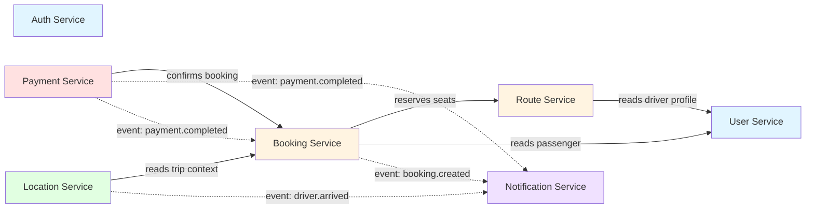

**Legend:**
- Solid arrows = synchronous (gRPC)
- Dotted arrows = asynchronous (Kafka events)

### 4.4 Service Templates

Every service follows this standard structure:

```
services/<service-name>/
├── src/
│   ├── controllers/       # HTTP/gRPC request handlers
│   ├── services/          # Business logic
│   ├── repositories/      # Data access layer
│   ├── models/            # Domain entities
│   ├── dto/               # Request/response DTOs
│   ├── middleware/        # Auth, logging, validation
│   ├── events/            # Event publishers/consumers
│   ├── clients/           # gRPC clients to other services
│   ├── config/            # Configuration loading
│   ├── utils/             # Helpers
│   └── server.ts          # Entry point
├── tests/
│   ├── unit/
│   ├── integration/
│   └── fixtures/
├── migrations/            # Database migrations
├── protos/                # gRPC service definitions
├── Dockerfile
├── package.json
├── tsconfig.json
├── .env.example
└── README.md              # Service-specific docs
```

---

## 5. Data Architecture

### 5.1 Database-Per-Service Pattern

Each service owns a logical database. Physically, they share a PostgreSQL cluster (for cost/simplicity), but they are logically isolated:

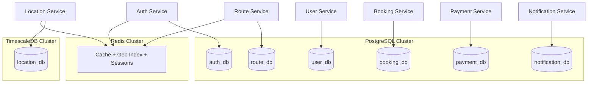

### 5.2 Data Ownership Rules

1. **A service's database is accessed ONLY by that service** — no sharing
2. **To get data from another service, use its API** (gRPC or REST)
3. **Cross-service joins** are done at the application layer, not the database
4. **Denormalization** is acceptable to avoid chatty cross-service calls
5. **Eventual consistency** is the default; strong consistency only where required (payments)

### 5.3 Core Data Entities

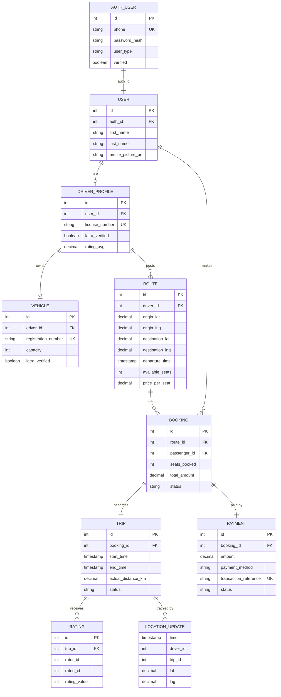

**Full schema details**: See [DATABASE_SCHEMA.md](DATABASE_SCHEMA.md)

### 5.4 Caching Strategy

| Cache Key Pattern | TTL | Purpose |
|-------------------|-----|---------|
| `driver:location:{id}` | 5 min | Latest GPS coords per driver |
| `drivers:online` (GEOSPATIAL) | rolling | Active drivers geo-indexed |
| `driver:status:{id}` | 5 min | online/offline/busy |
| `route:search:{hash}` | 1 min | Popular search results |
| `session:{user_id}` | 15 min | JWT validation context |
| `otp:{phone}` | 5 min | OTP code + attempt count |
| `ratelimit:{user}:{endpoint}` | 1 hr | Sliding window counter |
| `booking:lock:{route_id}` | 2 min | Optimistic lock for seat reservation |
| `mpesa:token` | 50 min | Access token reuse |
| `latra:token` | 50 min | LATRA OAuth token |

---

## 6. Communication Patterns

### 6.1 Pattern Selection Guide

| Pattern | When to Use | Implementation |
|---------|-------------|----------------|
| **REST over HTTPS** | Mobile/web client ↔ backend | Fastify |
| **gRPC** | Service ↔ service (synchronous) | @grpc/grpc-js |
| **Kafka events** | Async workflows, fan-out | kafkajs |
| **Redis Pub/Sub** | Low-latency broadcasts | ioredis |
| **WebSocket** | Real-time (location, notifications) | socket.io |

### 6.2 Synchronous Communication (gRPC)

**When**: Service A needs data from Service B to complete a request.

**Rules**:
- Max 2-hop chains (A→B→C is the limit)
- Always include deadlines/timeouts (default: 2 seconds)
- Circuit breakers on every client
- Retries with exponential backoff

**Example**: Route Service fetching driver profile

```protobuf
// user.proto
syntax = "proto3";

service UserService {
  rpc GetDriverProfile(GetDriverProfileRequest) returns (DriverProfile);
  rpc GetDriversBatch(GetDriversBatchRequest) returns (DriversBatchResponse);
}

message GetDriverProfileRequest {
  int32 driver_id = 1;
}

message DriverProfile {
  int32 id = 1;
  string first_name = 2;
  string last_name = 3;
  string profile_picture_url = 4;
  double rating_avg = 5;
  bool latra_verified = 6;
}
```

### 6.3 Asynchronous Communication (Kafka Events)

**When**: Fire-and-forget, multiple consumers, eventual consistency is acceptable.

**Topics**:

| Topic | Publisher | Consumers | Payload |
|-------|-----------|-----------|---------|
| `booking.created` | Booking | Notification | Booking ID, driver ID, passenger ID |
| `booking.confirmed` | Booking | Notification, Location | Booking ID, trip ID |
| `booking.cancelled` | Booking | Notification, Payment | Booking ID, refund flag |
| `payment.completed` | Payment | Booking | Payment ID, booking ID, amount |
| `payment.failed` | Payment | Booking, Notification | Payment ID, reason |
| `trip.started` | Booking | Location, Notification | Trip ID, timestamp |
| `trip.completed` | Booking | Payment, Notification | Trip ID, metrics |
| `driver.location.updated` | Location | (optional consumers) | Driver ID, lat/lng |
| `driver.arrived` | Location | Notification | Driver ID, trip ID |

**Full event schemas**: See [EVENT_SCHEMAS.md](EVENT_SCHEMAS.md)

### 6.4 Real-Time Communication (WebSocket)

**Only** used for:
- Driver → Server: GPS location updates (every 30 seconds)
- Server → Passenger: Live driver location on active trip
- Server → User: Instant notifications (booking confirmed, etc.)

**NOT** used for:
- Regular API calls (use REST)
- Service-to-service (use gRPC)
- Bulk data transfer

### 6.5 External Integrations

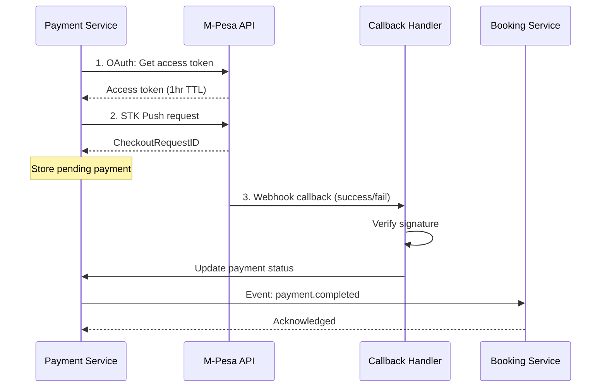

**Retry & idempotency**: All external calls use idempotency keys. Webhooks are idempotent on transaction reference.

---

## 7. Cross-Cutting Concerns

### 7.1 Authentication & Authorization

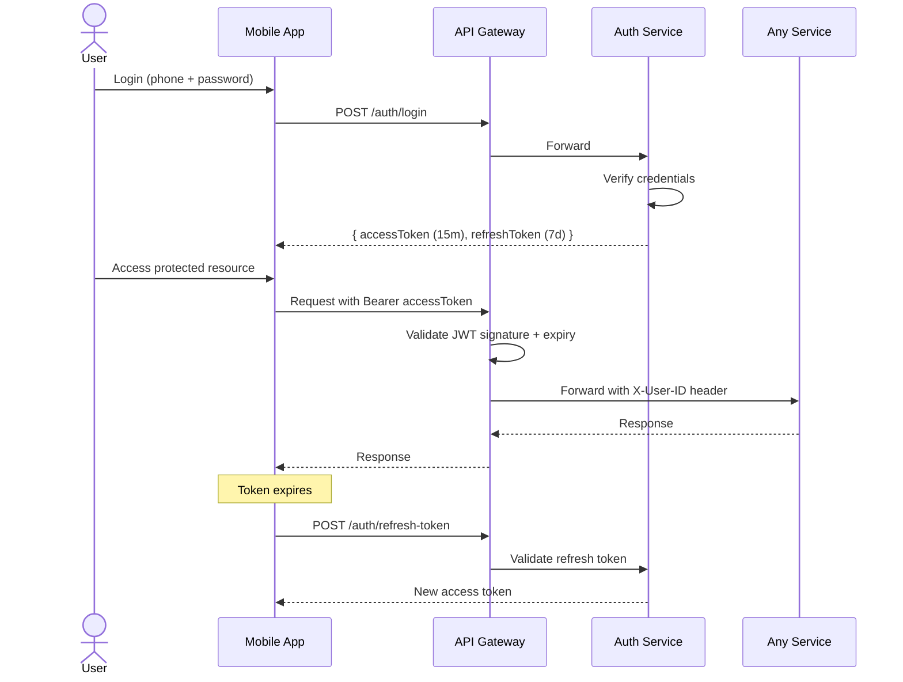

**Token Structure**:

```json
{
  "sub": "123",           // user_id
  "type": "driver",       // user type
  "verified": true,
  "iat": 1738367400,
  "exp": 1738368300,      // 15 minutes
  "jti": "unique-id"      // for revocation
}
```

**Authorization Matrix**:

| Role | Endpoints | Data Access |
|------|-----------|-------------|
| `anonymous` | `/auth/register`, `/auth/login`, `/routes/search` (public) | Read-only routes |
| `rider` | Bookings, payments, own profile | Own data + driver public info |
| `driver` | Routes CRUD, own profile, earnings | Own data + passenger contact on active trip |
| `admin` | All endpoints | All data (audited) |

### 7.2 Observability Stack

**Three pillars**:

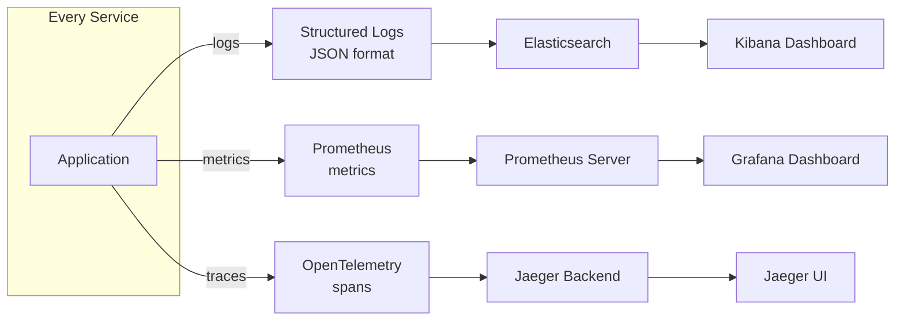

**Required Logs** (every request):
```json
{
  "timestamp": "2026-03-15T08:23:45.123Z",
  "level": "info",
  "service": "booking-service",
  "trace_id": "abc123",
  "span_id": "def456",
  "user_id": 42,
  "method": "POST",
  "path": "/api/bookings",
  "status": 201,
  "duration_ms": 87,
  "message": "Booking created"
}
```

**Required Metrics** (per service):
- `http_request_duration_seconds` (histogram)
- `http_requests_total` (counter)
- `db_query_duration_seconds` (histogram)
- `cache_hit_ratio` (gauge)
- `active_connections` (gauge)
- Custom business metrics (e.g., `bookings_created_total`)

### 7.3 Error Handling

**Standardized error response**:

```json
{
  "success": false,
  "error": {
    "code": "BOOKING_SEATS_UNAVAILABLE",
    "message": "Only 1 seat available, you requested 2",
    "details": {
      "available_seats": 1,
      "requested_seats": 2,
      "route_id": 123
    },
    "trace_id": "abc123"
  }
}
```

**HTTP Status Code Usage**:

| Code | Use Case |
|------|----------|
| 200 | Successful GET, PUT |
| 201 | Successful POST (resource created) |
| 204 | Successful DELETE |
| 400 | Client error (validation, bad input) |
| 401 | Unauthenticated (no/invalid token) |
| 403 | Authenticated but forbidden |
| 404 | Resource not found |
| 409 | Conflict (e.g., duplicate registration) |
| 422 | Business rule violation |
| 429 | Rate limit exceeded |
| 500 | Internal server error |
| 503 | Service temporarily unavailable |

### 7.4 Security Posture

| Layer | Control |
|-------|---------|
| **Transport** | TLS 1.3 everywhere, HSTS headers |
| **Network** | Private VPC, services not exposed to internet |
| **Gateway** | Rate limiting, IP allowlisting for admin |
| **Application** | Input validation (zod), parameterized queries, CSRF tokens |
| **Data** | Encryption at rest (AES-256), PII masking in logs |
| **Secrets** | HashiCorp Vault / AWS Secrets Manager, never in code |
| **Identity** | JWT with short TTL, refresh rotation, session revocation |
| **Audit** | All admin actions logged, immutable audit trail |

**Full details**: See [SECURITY.md](SECURITY.md)

---

## 8. Deployment Architecture

### 8.1 Environments

| Environment | Purpose | Infrastructure | Data |
|-------------|---------|----------------|------|
| **Local** | Developer machines | Docker Compose | Seeded test data |
| **Development** | Integration testing | Shared dev cluster | Reset nightly |
| **Staging** | Pre-production, demos | Mirrors prod (smaller) | Anonymized prod snapshot |
| **Production** | Live users | Full cluster | Real data |

### 8.2 Deployment Topology (Production)

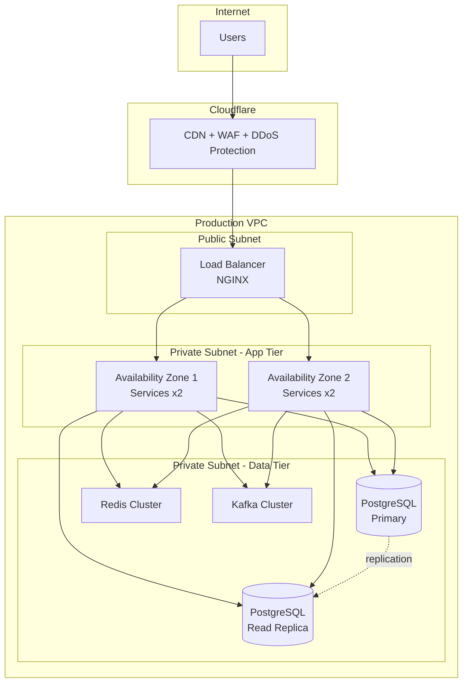

### 8.3 CI/CD Pipeline

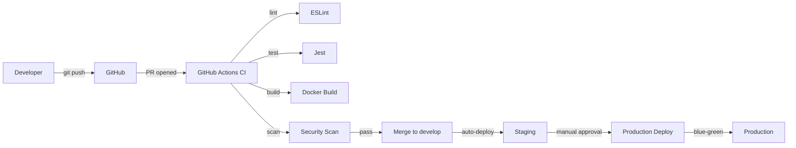

**Full deployment details**: See [DEPLOYMENT.md](DEPLOYMENT.md)

---

## 9. Architecture Decision Records (ADRs)

These ADRs document the "why" behind key decisions.

### ADR-001: Service-Oriented Architecture over Monolith

**Status**: Accepted
**Date**: 2026-02-15

**Context**: We need to decide between a monolith and microservices for Rishfy.

**Decision**: Service-Oriented Architecture with 7 services.

**Rationale**:
- 4 developers can parallelize work across services
- Clear ownership reduces merge conflicts
- Services can be independently scaled (Location Service has different load profile than Auth)
- Demonstrates production-grade architecture for FYP evaluation
- Easier to adopt DOMA (Domain-Oriented Microservices) in future

**Consequences**:
- ➕ Parallel development velocity
- ➕ Failure isolation
- ➖ Operational complexity (deployment, monitoring)
- ➖ Inter-service communication overhead
- **Mitigation**: Start with shared PostgreSQL cluster, clear service contracts, extensive documentation

---

### ADR-002: Node.js/TypeScript for Backend

**Status**: Accepted
**Date**: 2026-02-15

**Context**: Backend language selection.

**Decision**: Node.js 20 LTS with TypeScript 5.

**Rationale**:
- Excellent for I/O-bound workloads (most of our work is API + DB)
- Native async/await fits real-time location tracking
- Uber's dispatch system uses Node.js (proven at scale)
- TypeScript adds type safety without sacrificing velocity
- Huge ecosystem, easy to find Tanzanian developers
- Unified language across frontend (if we add web) and backend

**Alternatives Considered**:
- Python (FastAPI): Slower, less real-time friendly
- Go: Faster but smaller Tanzania talent pool
- Java/Spring: Heavy, slow developer ramp-up

---

### ADR-003: PostgreSQL over MySQL

**Status**: Accepted
**Date**: 2026-02-15

**Context**: Primary database selection.

**Decision**: PostgreSQL 15 with PostGIS and TimescaleDB extensions.

**Rationale**:
- PostGIS is best-in-class for geospatial queries (critical for route matching)
- TimescaleDB is a PostgreSQL extension for time-series (location tracking)
- JSON/JSONB support for flexible schema evolution
- Better default behavior for our scale
- Note: Uber eventually chose MySQL but their scale is 1000x ours; their pain points don't apply

---

### ADR-004: Monorepo over Polyrepo

**Status**: Accepted
**Date**: 2026-02-15

**Context**: Repository structure for multi-service project.

**Decision**: Single monorepo with service subdirectories.

**Rationale**:
- 4-person team benefits from atomic cross-service changes
- Shared types/utilities in `shared/` directory
- Single CI/CD pipeline, easier to maintain
- Academic context: supervisors review one repo, not seven

**Consequences**:
- ➖ Build system slightly more complex (use Turborepo or Nx if needed)
- ➕ Easier onboarding
- ➕ Refactoring across services is atomic

---

### ADR-005: gRPC for Inter-Service, REST for Clients

**Status**: Accepted
**Date**: 2026-02-15

**Context**: How should services communicate with each other vs. with clients?

**Decision**:
- **Clients → Gateway → Services**: REST/HTTPS
- **Service → Service (sync)**: gRPC
- **Service → Service (async)**: Kafka events

**Rationale**:
- REST is universal for mobile/web clients
- gRPC is 5-10x faster than REST for internal calls
- Protobuf contracts provide strong typing across service boundaries
- Kafka decouples services for async flows (notifications, analytics)

---

### ADR-006: JWT Stateless Authentication

**Status**: Accepted
**Date**: 2026-02-15

**Context**: Session management approach.

**Decision**: JWT access tokens (15min) + refresh tokens (7 days).

**Rationale**:
- Stateless = services don't need to hit Auth service for every request
- Short TTL limits blast radius of token theft
- Refresh tokens enable seamless UX
- Revocation list in Redis for emergency invalidation

---

### ADR-007: Flutter for Mobile

**Status**: Accepted
**Date**: 2026-02-15

**Context**: Mobile app framework.

**Decision**: Flutter 3.x targeting Android primary, iOS secondary.

**Rationale**:
- Single codebase for Android + iOS (4-person team can't maintain 2 native apps)
- Growing Flutter community in Tanzania
- Excellent performance for our use case (maps, real-time)
- Strong Google backing, stable ecosystem

---

### ADR-008: Database-per-Service with Shared Cluster

**Status**: Accepted
**Date**: 2026-02-15

**Context**: How to achieve logical data isolation without operational overhead of 7 database instances.

**Decision**: Single PostgreSQL cluster with 7 logical databases.

**Rationale**:
- True database-per-service would require 7 instances (operationally expensive for team of 4)
- Logical databases enforce API-only access (no shared schemas)
- Easy to split into physical instances when scaling demands it
- Shared cluster reduces cost during development

**Migration Path**: When any single service exceeds its DB's capacity, extract to dedicated instance.

---

### ADR-009: Redis for Cache + Geo Index + Sessions

**Status**: Accepted
**Date**: 2026-02-15

**Context**: Caching and geospatial indexing.

**Decision**: Single Redis instance serving multiple use cases.

**Rationale**:
- Redis geospatial commands (GEOADD, GEORADIUS) are perfect for "find nearby drivers"
- TTL-based caching simpler than Memcached
- Pub/Sub for lightweight events
- Single service to operate vs. multiple specialized stores

---

### ADR-010: Mobile Money Integration Strategy

**Status**: Accepted
**Date**: 2026-02-15

**Context**: How to handle multiple mobile money providers (M-Pesa, TigoPesa, Airtel Money).

**Decision**: Abstract `PaymentProvider` interface with provider-specific implementations.

**Rationale**:
- Interface allows swapping providers without changing Payment Service logic
- Each provider has different API quirks (callbacks, auth, error codes)
- Users can choose their preferred provider
- Future-proof for Stripe, PayPal when international expansion happens

---

## 10. Scalability Strategy

### 10.1 Horizontal Scaling Plan

Every service is designed stateless and can scale horizontally:

| Service | Current | Scale Trigger | Scale-Up Strategy |
|---------|---------|--------------|-------------------|
| Auth | 2 instances | CPU > 70% | Add instances (stateless) |
| User | 2 instances | CPU > 70% | Add instances, add read replicas |
| Route | 2 instances | Search latency > 500ms | Add instances, warm Redis cache |
| Booking | 3 instances | Transaction rate spike | Add instances, shard by route_id |
| Payment | 2 instances | Webhook queue growing | Add instances + workers |
| Location | 2 instances | WebSocket connections > 5k | Add instances (sticky sessions) |
| Notification | 2 instances | Queue depth > 1000 | Add workers |

### 10.2 Scalability Milestones

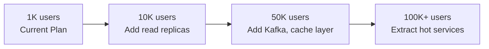

**Current plan targets up to 50K users.** Beyond that, revisit the architecture.

### 10.3 Performance Targets

| Metric | Target | Measurement |
|--------|--------|-------------|
| API p50 latency | < 100ms | At API Gateway |
| API p95 latency | < 200ms | At API Gateway |
| API p99 latency | < 500ms | At API Gateway |
| Route search | < 1s | End-to-end |
| Booking creation | < 2s | End-to-end (incl. payment init) |
| Push notification delivery | < 3s | Event → device |
| Driver location update | < 500ms | Mobile → Redis |
| LATRA daily report | < 5 min | Cron execution |
| Database query p95 | < 50ms | Service layer |

---

## Quick Reference

### Service URLs (Local Dev)

```
API Gateway:        http://localhost:8080
Auth Service:       http://localhost:3001
User Service:       http://localhost:3002
Route Service:      http://localhost:3003
Booking Service:    http://localhost:3004
Payment Service:    http://localhost:3005
Location Service:   ws://localhost:3006
Notification:       http://localhost:3007

PostgreSQL:         localhost:5432
Redis:              localhost:6379
Kafka:              localhost:9092
Prometheus:         http://localhost:9090
Grafana:            http://localhost:3000
Jaeger UI:          http://localhost:16686
```

### Related Documents

- [README.md](../README.md) - Project overview
- [SETUP_GUIDE.md](SETUP_GUIDE.md) - Development environment setup
- [DATABASE_SCHEMA.md](DATABASE_SCHEMA.md) - Detailed schema
- [API_CONTRACTS.md](API_CONTRACTS.md) - API specifications
- [EVENT_SCHEMAS.md](EVENT_SCHEMAS.md) - Kafka event definitions
- [SPRINT_PLAN.md](SPRINT_PLAN.md) - Development roadmap

---

**Document Owner**: Architecture Team
**Last Updated**: 2026-03-15
**Version**: 2.0
**Status**: Approved for Development
